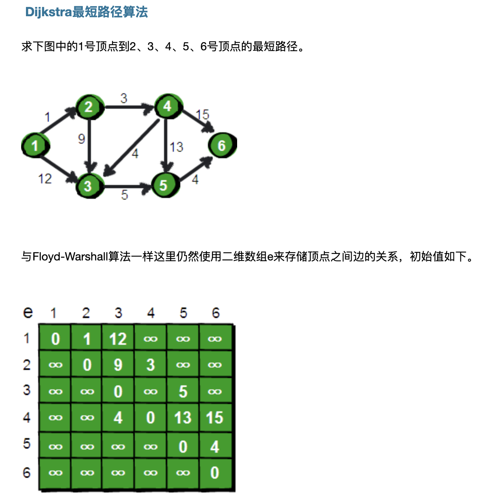

[dijkstra](https://www.cnblogs.com/GumpYan/p/5540560.html)




思想:

每次找到离源点最近的一个顶点,然后以该顶点为中心进行扩展,最终得到源点到其余所有点的最短路径


```
package main

import (
	"fmt"
	"math"
)

func main() {
	n := 7
	arr := [7][7]int{}


	minpath := [7][7][]int{}
	for i:=0;i<=6;i++ {
		for j:=0;j<=6;j++ {
			minpath[i][j]= make([]int,0)
		}
	}

	arr[1][1] = 0
	arr[1][2] = 1
	arr[1][3] = 12
	arr[1][4] = math.MaxInt32
	arr[1][5] = math.MaxInt32
	arr[1][6] = math.MaxInt32

	arr[2][1] = math.MaxInt32
	arr[2][2] = 0
	arr[2][3] = 9
	arr[2][4] = 3
	arr[2][5] = math.MaxInt32
	arr[2][6] = math.MaxInt32

	arr[3][1] = math.MaxInt32
	arr[3][2] = math.MaxInt32
	arr[3][3] = 0
	arr[3][4] = math.MaxInt32
	arr[3][5] = 5
	arr[3][6] = math.MaxInt32


	arr[4][1] = math.MaxInt32
	arr[4][2] = math.MaxInt32
	arr[4][3] = 4
	arr[4][4] = 0
	arr[4][5] = 13
	arr[4][6] = 15

	arr[5][1] = math.MaxInt32
	arr[5][2] = math.MaxInt32
	arr[5][3] = math.MaxInt32
	arr[5][4] = math.MaxInt32
	arr[5][5] = 0
	arr[5][6] = 4

	arr[6][1] = math.MaxInt32
	arr[6][2] = math.MaxInt32
	arr[6][3] = math.MaxInt32
	arr[6][4] = math.MaxInt32
	arr[6][5] = math.MaxInt32
	arr[6][6] = 0


	for k:=1;k<=n-1;k++{
		arr1 := arr[k]
		mem := make([]int, 7)
		mem[k] = 1

		for {
			//找到最短距离的位置
			min := math.MaxInt32
			position := 0
			for i:=1;i<=n-1;i++ {
				if mem[i] == 0 && min > arr1[i] {
					position = i
					min = arr1[i]
				}
			}

			if position == 0 {
				break
			}
			mem[position] = 1
			if len(minpath[k][position]) == 0 {
				minpath[k][position] = []int{k,position}
			}

			if position==2 {
				fmt.Println("2")
			}

			for i:=1;i<=n-1;i++ {
				if arr1[i] > arr1[position] + arr[position][i] {
					arr1[i] = arr1[position] + arr[position][i]
					
					tmp := make([]int, len(minpath[k][position]))
					copy(tmp, minpath[k][position])
					minpath[k][i] = append(tmp,i)


				}
			}

		}

		//fmt.Println(arr1)
		arr[k] = arr1
	}


	for i:=1;i<=n-1;i++ {
		for j:=1;j<=n-1;j++ {
			fmt.Printf("%d->%d:%d,path:",i,j,arr[i][j])
			fmt.Println(minpath[i][j])
		}
	}


}


```


```
1->1:0,path:[]
1->2:1,path:[1 2]
1->3:8,path:[1 2 4 3]
1->4:4,path:[1 2 4]
1->5:13,path:[1 2 4 3 5]
1->6:17,path:[1 2 4 3 5 6]
2->1:2147483647,path:[]
2->2:0,path:[]
2->3:7,path:[2 4 3]
2->4:3,path:[2 4]
2->5:12,path:[2 4 3 5]
2->6:16,path:[2 4 3 5 6]
3->1:2147483647,path:[]
3->2:2147483647,path:[]
3->3:0,path:[]
3->4:2147483647,path:[]
3->5:5,path:[3 5]
3->6:9,path:[3 5 6]
4->1:2147483647,path:[]
4->2:2147483647,path:[]
4->3:4,path:[4 3]
4->4:0,path:[]
4->5:9,path:[4 3 5]
4->6:13,path:[4 3 6]
5->1:2147483647,path:[]
5->2:2147483647,path:[]
5->3:2147483647,path:[]
5->4:2147483647,path:[]
5->5:0,path:[]
5->6:4,path:[5 6]
6->1:2147483647,path:[]
6->2:2147483647,path:[]
6->3:2147483647,path:[]
6->4:2147483647,path:[]
6->5:2147483647,path:[]
6->6:0,path:[]

```