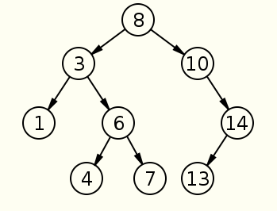

```
任意节点x，x.left.key< x.key < x.right.key

判断一棵树是否为二叉搜索树的思路为：将所有节点的值用中序遍历追加到一个数组中，
然后判断这个数组是否是递增数组，如果是递增数组，那么这棵树为二叉搜索树，否则不是二叉搜索树
```



- 思路1 中序遍历，然后判断是否升序
```

type TreeNode struct {
	Val   int
	Left  *TreeNode
	Right *TreeNode
}


func parse(root *TreeNode) []int {
	res := make([]int, 0)
	if root == nil {
		return res
	}
	res = append(res, parse(root.Left)...)
	res = append(res, root.Val)
	res = append(res, parse(root.Right)...)
	return res
}

func isValidBST2(root *TreeNode) bool {
	if root == nil {
		return ture
	}
	res := parse(root)
	fmt.Println("res:", res)
	if len(res) == 1 {
		return true
	}
	preValue := res[0]
	l := len(res)

	for i := 1; i < l; i++ {
		if preValue >= res[i] {
			return false
		}
		preValue = res[i]
	}
	return true
}


```

- 思路2 从顶级逐级递推

```
func isValidBST(root *TreeNode) bool {
	return _isValidBST2(root, math.MinInt64, math.MaxInt64)
}

func _isValidBST2(node *TreeNode, min int, max int) bool {
	if node == nil {
		return true
	}

	if node.Val > min && node.Val < max && _isValidBST2(node.Left, min, node.Val) && _isValidBST2(node.Right, node.Val, max) {
		return true
	}

	return false
}
```