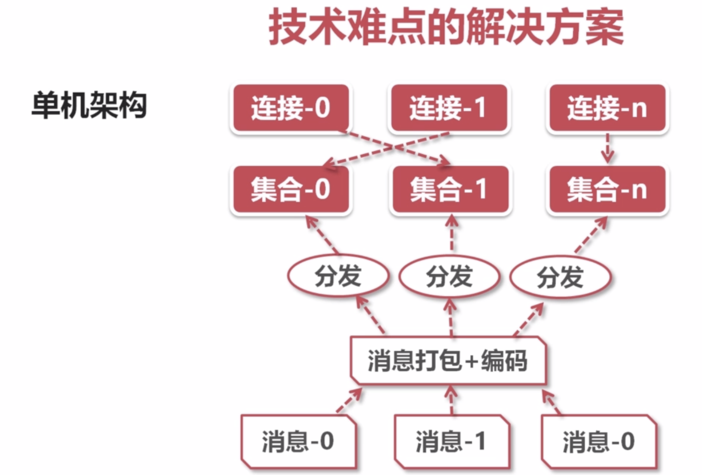
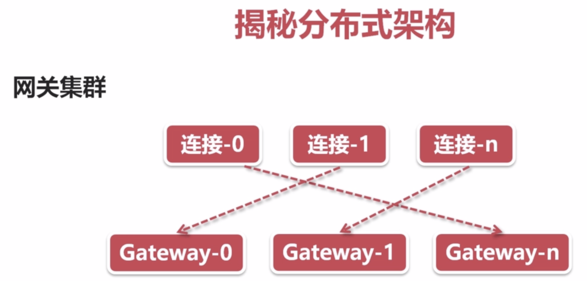
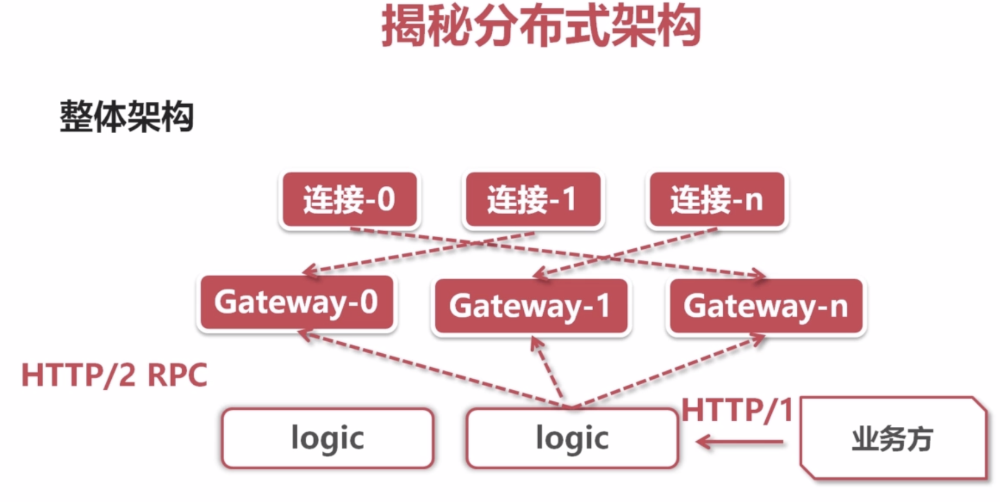

## 弹幕的技术复杂度

一个直播间
	
	- 在线人数: 100万
	- 发送弹幕: 1000条/秒 
	- 推送频率: 100万*1000条/秒 = 10亿条/秒

N个直播间

	- 推送频率: N*10亿条/秒

## 拉模式与推模式的区别

拉模式 :客户端轮询服务端
	
	- 服务端更新频率低,则大多数请求是无效的
	- 在线用户数量多,则服务端的查询负载很高 每秒百万请求类似DDOS攻击
	- 定时轮询拉取,无法满足时效性的要求

推模式

	- 仅在数据更新时才需要推送,可以立即推送(高时效)
	- 需要维护大量的在线长连接

选型websocket推送

	- 浏览器支持的socket编程,轻松维持服务端的长连接
	- 基于TCP可靠传输之上的协议,无需关心通讯细节
	- 提供高度抽象的编程接口,业务开发成本低

	
## websocket 协议与交互

通讯流程

传输原理

	- 协议升级后,继续复用http的底层socket完成后续通讯
	- message 底层被切分成多个frame帧传输,无需关心frame

抓包观察
	

## 服务端的技术选型与考虑

NodeJS

	- 单线程模型,推送性能有限,虽然可以多进程,但是需要遍历在线用户集合,多进程连接被散列在多进程上

c/c++

	- 造轮子成本高

go

	- 多线程,基于协程模型并发
	- 成熟的websocket标准库,无需造轮子

	
## go实现websocket服务端

## 弹幕系统技术难点分析(千万级)

三个性能瓶颈
	
	- 内核瓶颈
		推送量大:100万在线*10条/秒 = 1000万条/秒
		linux内核发送tcp的极限包频 大约 100万/条
		
		减少网络小包的发送,将同一秒内的N条消息合并成一条,合并后每秒推送的次数等于在线连接数
	- 锁瓶颈
		需要维护的在线用户集合(100万在线),通常是一个字典
		推送消息即遍历整个集合,顺序发送消息,耗时极长
		推送期间,客户端正常上下线,所以集合需要上锁
		
		
		连接打散到多个集合,每个集合有自己的锁,多线程并发推送多个集合,避免锁竞争
		读写锁替代互斥锁,多个推送任务可以并发遍历相同集合
		
		
	- cpu瓶颈
		浏览器与服务端通常采取json格式通讯
		json编码消耗cpu
		
		
		
		1次消息编码+ 100万次推送,消息合并后编码
		
		
单机架构

单机瓶颈

	- 维护海量长连接会花费不少内存
	- 消息瞬时推送消耗大量cpu资源
	- 消息推送瞬时带宽达400-600MB(4-6Gbits)是主要瓶颈

分布式

当要推送一个消息出去的时候,不知道那个直播间在那个网关节点上,把消息广播到所有消息节点,各自去做
判断推送

逻辑集群负责把消息广播到网关,应用http2---http2支持连接复用,用作RPC性能更佳
业务方发送消息:例如广播一个🚀,应用http1 ---更加友好

## 技术

	- 生产工具,就像斧子、铲子一样
	- 开发语言、框架都是技术,努力学习大多可以掌握

## 思想

	- 常年累月对技术的积累和理解
	- 合理的设计、架构经验、来自不断的技术积累与总结

## 精神

	- 不再局限于特定的技术体系与思想体系,凭借直觉快速抓住问题本质

	
	