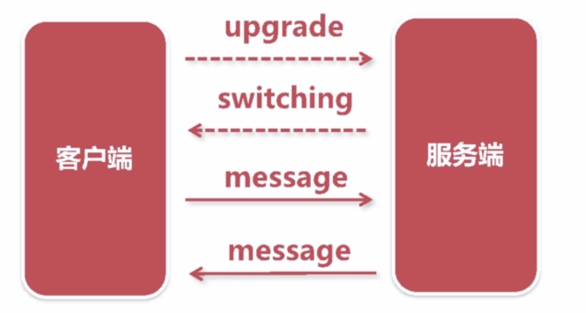

## 弹幕的技术复杂度

一个直播间
	
	- 在线人数: 100万
	- 发送弹幕: 1000条/秒 
	- 推送频率: 100万*1000条/秒 = 10亿条/秒

N个直播间

	- 推送频率: N*10亿条/秒

## 拉模式与推模式的区别

拉模式 :客户端轮询服务端
	
	- 服务端更新频率低,则大多数请求是无效的
	- 在线用户数量多,则服务端的查询负载很高 每秒百万请求类似DDOS攻击
	- 定时轮询拉取,无法满足时效性的要求

推模式

	- 仅在数据更新时才需要推送,可以立即推送(高时效)
	- 需要维护大量的在线长连接

选型websocket推送

	- 浏览器支持的socket编程,轻松维持服务端的长连接
	- 基于TCP可靠传输之上的协议,无需关心通讯细节
	- 提供高度抽象的编程接口,业务开发成本低

	
## websocket 协议与交互

通讯流程

传输原理

	- 协议升级后,继续复用http的底层socket完成后续通讯
	- message 底层被切分成多个frame帧传输,无需关心frame

抓包观察
	

## 服务端的技术选型与考虑

NodeJS

	- 单线程模型,推送性能有限,虽然可以多进程,但是需要遍历在线用户集合,多进程连接被散列在多进程上

c/c++

	- 造轮子成本高

go

	- 多线程,基于协程模型并发
	- 成熟的websocket标准库,无需造轮子

	
## 

	