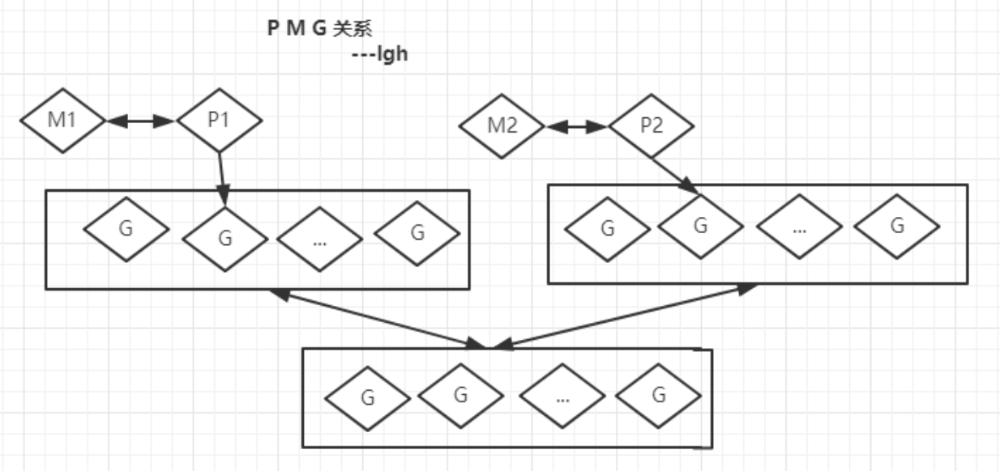

- 调度器的三个基本对象

```
G(Goroutine),代表协程,也就是每次代码中使用 go 关键词时候会创建的一个对象
M(Work Thread),工作线程
P(Processor),代表一个处理器,又称上下文
```

- G-M-P三者的关系与特点

```
每一个运行的M都必须绑定一个P,线程M创建后会去检查并执行G(goroutine)对象
每一个P保存着一个协程G的队列
除了每个P自身保存的G队列外,调度器还拥有一个全局的G队列
M从队列中提取G,并执行
P的个数就是GOMAXPROCS(最大256),启动时固定的,一般不修改
M的个数和P的个数不一定一样多(会有休眠的M或P不绑定M)(最大10000)
P是用一个全局数组(255)来保存,并且维护着一个全局的P空闲链表
```

- 局部G队列与全局G队列的关系

```
全局G任务队列会和各个本地G任务队列按照一定的策略互相交换(协程任务交换)
G任务的执行顺序:先从本地队列找,本地没有则从全局队列找

```

- goroutine 从入队到执行

```
1、当我们创建一个G对象,就是goroutine,它会加入到本地队列或者全局队列
2、如果还有空闲的p,则创建一个M绑定该p,注意 这里P此前必须还没绑定过M,否则不满足空闲的条件
	
细节点:
	1.先找到一个空闲的P,如果没有则直接返回
	2.P的个数不会超过自己设定的cpu个数
	3.p被M绑定后,就会初始化自己的G队列,此时是一个空队列
	4.注意:
		无论在哪个M中创建了一个G,只要P有空闲,就会引起新的M的创建
		不需要考虑当前所在M中所绑定的P的G队列是否已满
		新创建的M所绑的P的初始化队列会从其他G队列中取任务过来
		
3、M会启动一个底层线程,循环执行能找到的G任务.
	当前M所绑定的P队列中找
	取别的P队列中找
	去全局G队列中找
4、G任务的执行顺序是,先从本地队列找,本地没有则从全局队列找
5、程序启动的时候,首先跑的是主线程,然后这个主线程会绑定第一个P
6、入口main函数,其实是作为一个goroutine来执行
	
	
```


- 问题如果一个G任务执行时间太长,它就会一直占用M线程,由于队列的G任务是顺序执行的,其他G任务就会阻塞,如何避免该情况发生?


```
协程的切换时间片是10ms,也就是说goroutine最多执行10ms就会被M切换到下一个G.这个过程,又被称为中断,挂起

原理:
	go程序启动时会首先创建一个特殊的内核线程sysmon,用来监控和管理,其内部是一个循环:
	1、记录所有的P的G任务的计数schedtick,schedtick会在每执行一个G任务后递增
	2、如果检查到schedtick 一直没有递增,说明这个P一直在执行同一个G任务,如果超过10ms,就在这个G任务的栈信息里面加一个tag标记
	3、然后这个G任务在执行的时候,如果遇到非内联函数调用,就会检查一次这个标记,然后中断自己,把自己加到队列末尾,执行下一个G
	4、如果没有遇到 非内联函数 调用的话,那就会一直执行这个G任务,知道它自己结束;如果是个死循环,并且
	GOMAXPROCS=1的话.那么一直只会只有一个p与一个m,且队列中的其他G不会被执行
		
```

- 中断后的恢复

```
	1、中断的时候将寄存器里的栈信息,保存到自己的G对象里面
	2、当再次轮到自己执行时,将自己保存的栈信息复制到寄存器里面,这样就接着上次之后运行
```

- runtime.Goshced()  让出时间片

```go

package main

import (
	"fmt"
	"runtime"
)

func main() {
	go func() { //让子协程先执行
		for i := 0; i < 5; i++ {
			fmt.Println("go")
		}
	}()
	for i := 0; i < 2; i++ {
		//让出时间片，先让别的协议执行，它执行完，再回来执行此协程
		runtime.Gosched()
		fmt.Println("hello")
	}
}

```
