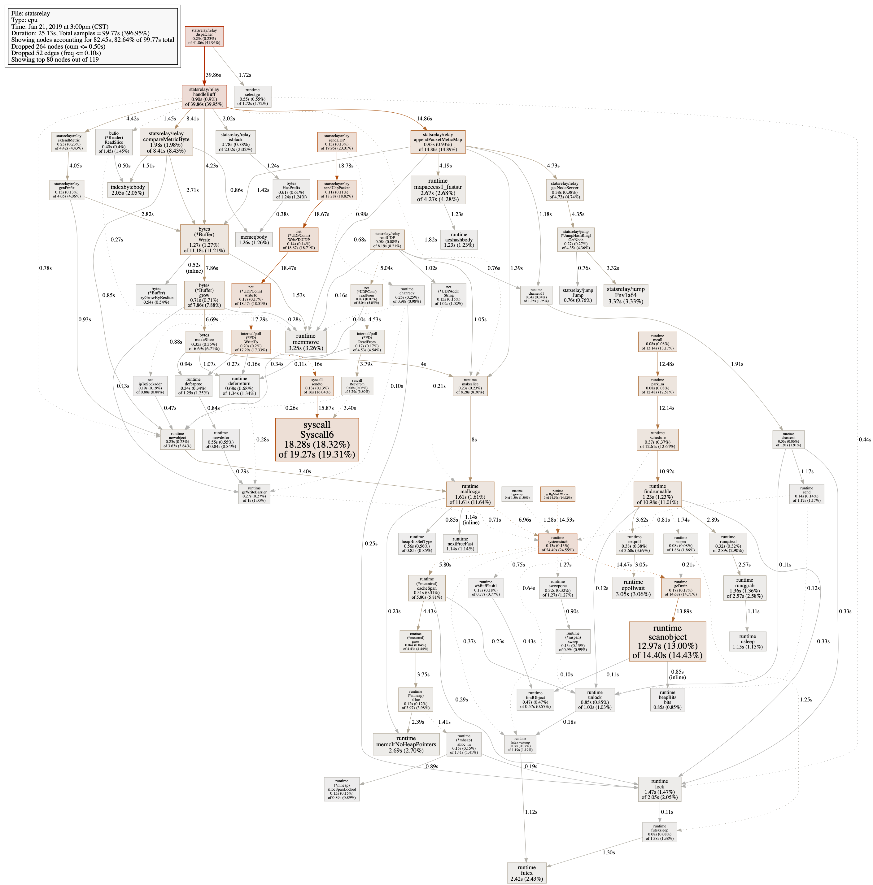

## 关于火焰图与trace的使用

go-torch appBin test.prof -f test.svg

go tool trace -http=x.x.x.x:8888 trace.trace

go tool pprof *.prof

[参考](http://lihaoquan.me/2017/1/1/Profiling-and-Optimizing-Go-using-go-torch.html)

```
git clone https://github.com/brendangregg/FlameGraph.git
cp flamegraph.pl /usr/local/bin
flamegraph.pl -h
go get -v github.com/uber/go-torch

```


```
    package prof
    
    import (
    	"os"
    	"log"
    	_ "net/http"
    	"runtime/pprof"
    	"runtime/trace"
    	_ "net/http/pprof"
    )
    
    
    var CpuProf *os.File
    var MemProf *os.File
    var TraceProf *os.File
    var StartProfChan = make(chan uint32, 1)
    var StopProfChan = make(chan uint32, 1)
    var StartTraceChan = make(chan uint32, 1)
    var StopTraceChan = make(chan uint32, 1)
    
    func SetStartProf() {
    	StartProfChan <- 1
    }
    func SetStopProf() {
    	StopProfChan <- 1
    }
    
    func SetStartTrace() {
    	StartTraceChan <- 1
    }
    func SetStopTrace() {
    	StopTraceChan <- 1
    }
    func StartTrace() {
    	var errTrace error
    	for {
    		<-StartTraceChan
    		TraceProf, errTrace = os.Create("./trace.trace")
    		if errTrace != nil {
    			log.Fatal(errTrace)
    		}
    		trace.Start(TraceProf)
    	}
    }
    
    func StopTrace() {
    	for {
    		<-StopTraceChan
    		trace.Stop()
    	}
    }
    
    func StartProf() {
    	var errCPU, errMEM error
    	for {
    		<-StartProfChan
    		CpuProf, errCPU = os.OpenFile("./cpu.prof", os.O_RDWR|os.O_CREATE, 0644)
    		if errCPU != nil {
    			log.Fatal(errCPU)
    		}
    		MemProf, errMEM = os.Create("./mem.prof")
    		if errMEM != nil {
    			log.Fatal(errMEM)
    		}
    		pprof.StartCPUProfile(CpuProf)
    	}
    }
    
    func StopProf() {
    	for {
    		<-StopProfChan
    		pprof.StopCPUProfile()
    		CpuProf.Close()
    		pprof.WriteHeapProfile(MemProf)
    		MemProf.Close()
    	}
    }
```

## 原生工具使用:

- 1、main函数中添加_ "net/http/pprof"

	```
	func init() {
	http.HandleFunc("/debug/pprof/", Index)
	http.HandleFunc("/debug/pprof/cmdline", Cmdline)
	http.HandleFunc("/debug/pprof/profile", Profile)
	http.HandleFunc("/debug/pprof/symbol", Symbol)
	http.HandleFunc("/debug/pprof/trace", Trace)
	}
	```
- 2、监听一个http端口即可

- 3、访问方法
	
	```
	 go tool pprof --seconds 25 http://localhost:9090/debug/pprof/profile
	```
	```
	或者网页访问:http://127.0.0.1:12345/debug/pprof/
	```
	



	
	
	
	出现 Failed to execute dot. Is Graphviz installed? Error: exec: "dot": executable file not found in $PATH 报错, 需要安装 graphviz 在 mac 上就直接 brew install graphviz 即可
	
	
	
	