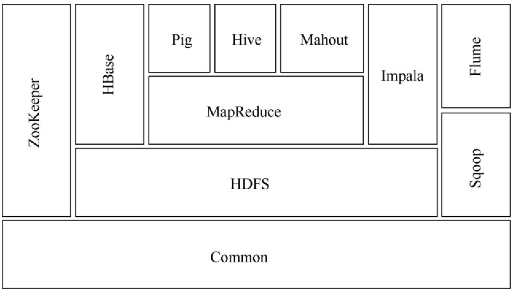

### hadoop定义

- hadoop是由一系列的软件(common提供远程的调用rpc、序列化;hdfs负责分布式数据存储;mapreduce负责分布式数据计算)组成的框架
- hadoop适合处理大规模数据
- hadoop被部署在一个集群上

### hadoop生态圈

- common 为hadoop各子项目提供各种工具:系统配置工具configuration、远程调用rpc、序列化机制、日志操作等,是其他模块的基础
- HDFS(Hadoop distributed file system),hdfs具有高度容错性的文件系统,适合部署在廉价的机器上.hdfs能提供高吞吐量的数据访问,非常适合大规模数据集上的应用
- MapReduce 是一种编程模型,利用函数式编程的思想,将对数据集处理的过程分为map和reduce两个阶段,hadoop提供了mapreduce的计算框架,实现了这种编程模型
- Hbase 分布式的、面向列的开源数据库,擅长大规模数据的随机、实时读写访问
- ZooKeeper 所有的分布式系统中,都需要考虑一致性的问题, ZooKeeper是一个分布式的服务框架,提供配置维护、名字服务、分布式同步、组服务等
- Hive Hadoop的一个数据仓库工具,可以将结构化的数据文件映射为一张表,提供简单的sql查询功能,并将sql语句转换成为mapreduce作业运行
- Pig和Hive类似,也是对大型数据进行分析和评估的工具
- Impala 可以对HDFS、HBase的数据提供直接查询互动的SQL
- Mahout 是一个机器学习和数据挖掘库
- flume 高可用、高可靠、分布式的海量日志采集、聚合和传输系统
- sqoop 可以将关系型数据库(mysql、oracle)的数据导入到hdfs、hive中;也可以将hdfs、hiva数据导出到关系型数据库

### 云计算的类型

- Iaas 基础设施即服务 vmware vshpere、微软的Hyper-V、开源的KVM、开源的Xen.利用虚拟化技术将硬件设备等基础资源封装成服务提供给用户使用
- paas 平台即服务 负责资源的动态扩缩容、数据冗余、自动灾备
- Saas 软件即服务

### 其他大数据处理平台

- storm 针对实时数据
- Apache Spark 

