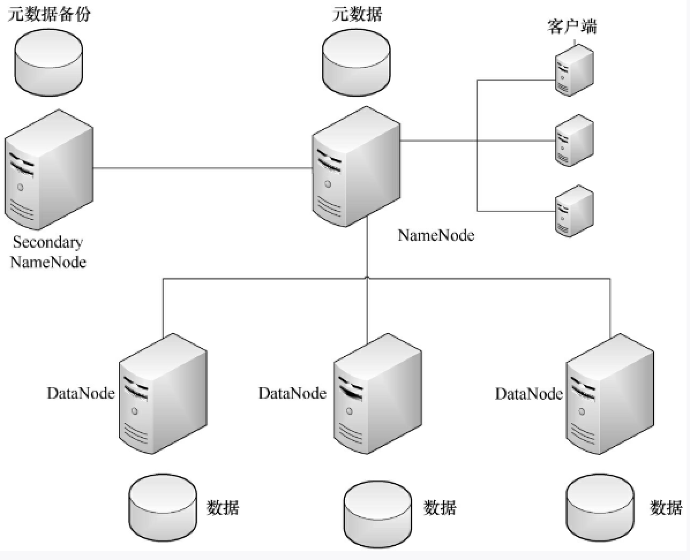
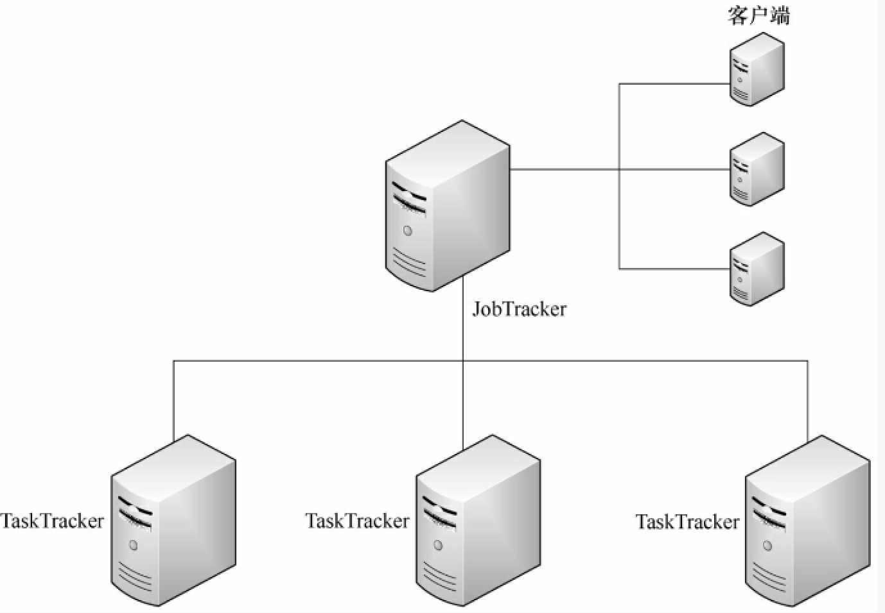
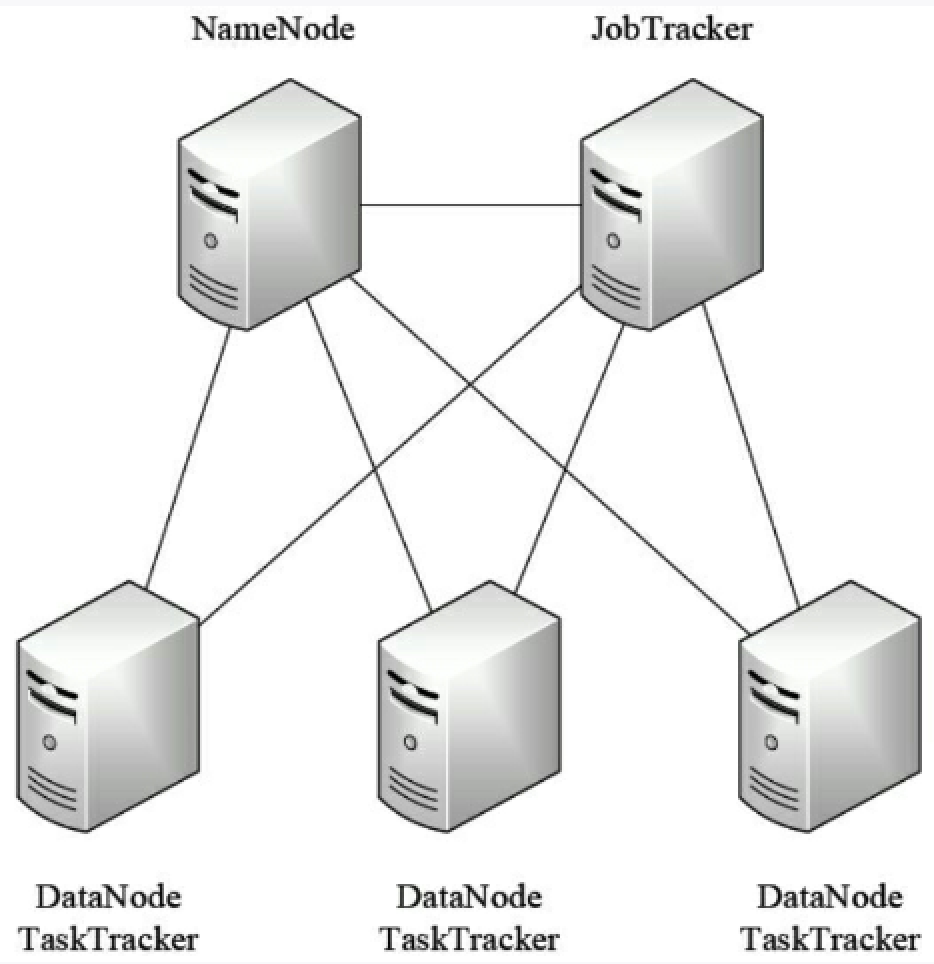

### hdfs

主从结构

- 守护进程 NameNode(管理者) 数量1 :存储文件系统的元数据,存储文件与数据块映射,并提供文件系统的全景图
- 守护进程 SecondaryNameNode 数量1 :备份NameNode数据,并负责镜像与NameNode日志数据的合并
- 守护进程 DataNode(工作者)  多个(至少一个): 存储块数据
- 客户端代表用户与整个文件系统交互的客户端

### mapreduce

主从结构:JobTracker和TaskTracker也是两种守护进程,运行在各自的节点上.客户端负责用户作业的提交

- 守护进程 JobTracker 1 :负责接受客户端作业提交,调度任务到TaskTracker上运行,并提供监控TaskTracker及任务进度等管理功能
- 守护进程 TaskTracker 多个(至少一个) 实例化用户程序,在本地执行任务并周期性地向JobTracker汇报状态

### hadoop 架构

DataNode和TaskTracker 需要配对部署在同一个节点上,NameNode和JobTracker不建议部署在同一个节点上

